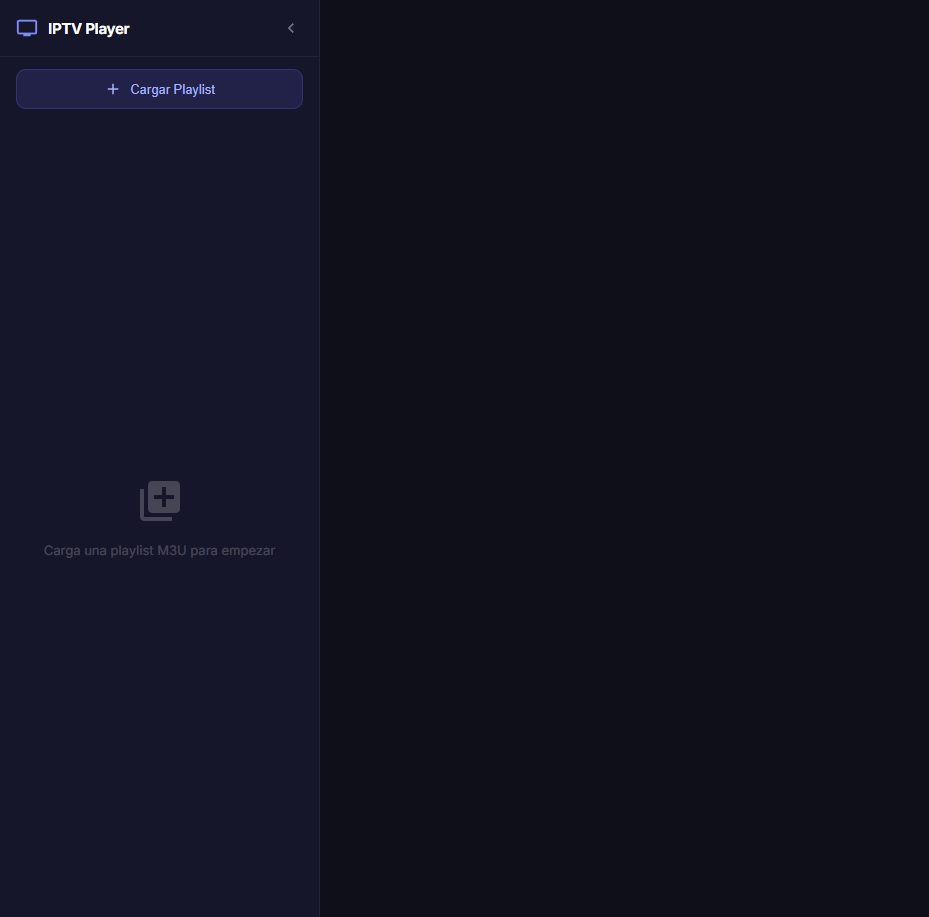
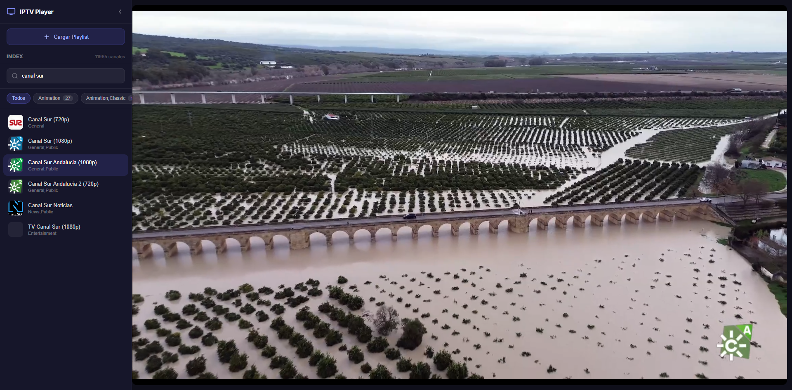

# Simple IPTV Player

Reproductor de listas IPTV (M3U/M3U8) de escritorio, construido con **Angular** y **Electron**.

Carga tus playlists desde una URL o un archivo local, navega por los canales agrupados por categoría y reproduce streams en directo con soporte HLS.




## Tecnologías

| Tecnología | Uso |
|---|---|
| [Angular 21](https://angular.dev/) | Framework de frontend (componentes, signals, routing) |
| [Electron 40](https://www.electronjs.org/) | Empaquetado como app de escritorio multiplataforma |
| [HLS.js](https://github.com/video-dev/hls.js/) | Reproducción de streams HLS en el navegador |
| [TypeScript 5.9](https://www.typescriptlang.org/) | Lenguaje principal del proyecto |
| [Vitest](https://vitest.dev/) | Tests unitarios |
| [electron-builder](https://www.electron.build/) | Generación de instaladores |

## Características

- Carga de playlists M3U desde URL o archivo local.
- Listado de canales con búsqueda y filtrado por grupo.
- Reproductor de vídeo con controles personalizados (play/pause, volumen, pantalla completa).
- Guardado de playlists en `localStorage` para acceso rápido.
- Barra lateral colapsable.

## Requisitos previos

- [Node.js](https://nodejs.org/) (v18 o superior)
- npm

## Instalación

```bash
git clone <url-del-repositorio>
cd simple-iptv-player
npm install
```

## Uso

### Desarrollo (navegador)

```bash
npm start
```

Abre `http://localhost:4200` en el navegador.

### Desarrollo (Electron)

```bash
npm run electron:dev
```

Levanta el servidor de Angular y abre la ventana de Electron automáticamente.

### Compilar para producción

```bash
npm run electron:build
```

Genera el instalador en la carpeta `release/`.

## Estructura del proyecto

```
electron/          → Proceso principal de Electron (main.js, preload.js)
src/
  app/
    components/
      channel-list/    → Lista de canales con búsqueda y grupos
      playlist-loader/ → Modal para cargar playlists
      video-player/    → Reproductor de vídeo con HLS.js
    models/            → Interfaces (Channel, ChannelGroup, SavedPlaylist)
    services/          → PlaylistService, StorageService
```

## Licencia

Este proyecto está bajo la licencia MIT.
